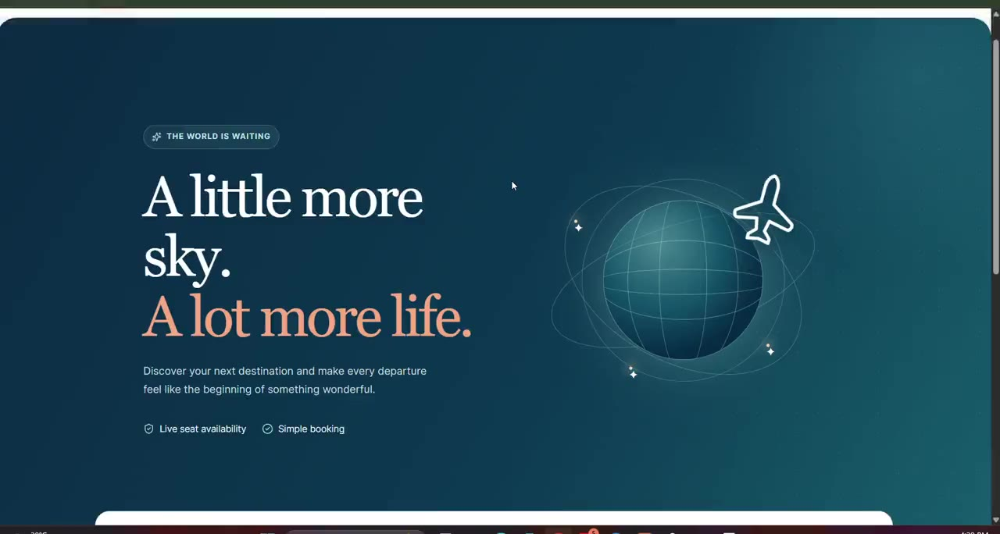

# Flight Booking: measured scaling improvements

This project combines five Node.js services with Docker-based MySQL, Redis, RabbitMQ, Prometheus, Grafana and Mailpit for the Flight Booking 10x assignment. The [Mermaid architecture document](docs/architecture.md) explains the complete local system and request flows. The [project guide](docs/project-guide.md) has every service's API routes, first-time startup, and dashboard links. See the [current-system inventory](docs/step-1-current-system.md) for the original architecture and baseline revisions.

**Current result:** transactional reservations prevent overselling and Redis caches flight reads, but the measured 200 requests/second workload still fails. The [diagnosis](docs/200rps-diagnosis.md) identifies flight event-loop delay, Redis client deadlines, bounded fallback 503s and synchronous local log writes. The [scaling plan](docs/scaling-plan.md) separates completed changes from proposed capacity work. No payments service was added, as agreed for this project.

Quick links: [whole-system diagram](docs/architecture.md#whole-system-diagram) · [booking sequence](docs/architecture.md#booking-recovery-and-notification) · [API reference](docs/project-guide.md#api-reference) · [Grafana dashboard](http://127.0.0.1:33000/d/flight-booking-overview) · [RabbitMQ UI](http://127.0.0.1:35673) · [Mailpit inbox](http://127.0.0.1:38025) · [k6 commands](load-tests/README.md).

## React web UI

The [Aeris UI](frontend/README.md) adds customer flight search/booking and local admin catalog tools using React, JavaScript, and Tailwind CSS. After starting the backend below, run `cd frontend`, `npm ci`, and `npm run dev`; open [http://127.0.0.1:5173](http://127.0.0.1:5173). Flight writes now require an ADMIN role; booking and cancellation use the verified token identity. See [authorization and admin setup](docs/authorization.md).

Run `node scripts/seed-demo-catalog.js` once the flight service is up to add **100 sample flights** between real Indian cities/airports with recognizable airline labels. The [schedule CSV](docs/demo-flight-schedule.csv) lists flight numbers, routes, and timings. [Demo-data details and sources](docs/demo-data.md) distinguish those real names from the fictional schedules and fares.

My journeys now loads [durable booking history](docs/booking-history.md) from the authenticated Booking API. Sign in again after closing your browser to see and cancel your own reservations.

## Project Demo

This 3-minute 34-second recording shows sign-in, admin flight publishing with its success message, catalog management, flight search, and booking confirmation in the local application.

[](https://github.com/inductionotg/FlightBooking-10x/raw/refs/heads/main/docs/media/project-demo.mp4)

[Watch or download the demo video (MP4)](https://github.com/inductionotg/FlightBooking-10x/raw/refs/heads/main/docs/media/project-demo.mp4). Click the preview above to open the recording; your browser may download it for playback.

## First-time setup (PowerShell)

Start Docker Desktop. From the root of your `FlightBooking-10x` checkout, install the locked dependencies:

```powershell
$services = @('Auth_Service', 'FlightandSearchService', 'Booking_Service', 'ReminderService', 'AIRLINE-MANAGEMENT_API_GATEWAY')
foreach ($service in $services) {
    Push-Location $service
    npm ci
    if ($LASTEXITCODE -ne 0) { Pop-Location; throw "Dependency installation failed: $service" }
    Pop-Location
}
docker compose -f compose.local.yml up -d --wait
node scripts/setup-local.js
```

The setup script is first-run only: it refuses to overwrite configuration or reuse existing baseline schemas. It uses a local-only database password defined in the Compose file. No production credentials are needed. The initial smoke test does not send email; the optional Mailpit setup below exercises SMTP without external credentials. Use only generated local credentials. The observability retrofit removes legacy sensitive console dumps; older saved logs are not retroactively sanitized.

New setups now apply each service's Sequelize migrations instead of creating tables with model sync. The existing local baseline databases are preserved; do not rerun setup against them.

## Verify migrations independently

With local MySQL running and dependencies installed:

```powershell
node scripts/verify-migrations.js
```

This creates random `migration_check_*` databases on localhost port 33306, exercises migrations and rollbacks, and removes only the databases it created. It checks booking defaults and model compatibility, user-role associations and database constraints, and full rollback/reapplication for all four database-backed services. Results are written to `docs/migration-check-results.json`.

The earlier local baseline used model sync and has no migration history. Do not run the migration CLI against that data without reconciling its schema and `SequelizeMeta` first. Likewise, a deployment that already ran the old booking migration must be inspected before applying pending migrations; this repair validates a fresh migration chain and does not change existing databases automatically.

## Start and verify

```powershell
./scripts/start-local.ps1
node scripts/create-local-admin.js
node scripts/seed-demo-catalog.js
node scripts/smoke-local.js
node scripts/verify-security.js
```

Services run on ports 3001–3004 and 3010, accessed over IPv6 loopback (`http://[::1]:PORT`). Startup launches processes but does not assert readiness; inspect `.local/*.stderr.log` if the smoke test fails. Results are saved to `docs/step-1-smoke-results.json`; the smoke command exits nonzero if a check or gateway routing fails. Repeated gateway requests may trigger its existing five-request/two-minute limit.

Application logs and launched process IDs are in `.local/`. To stop, inspect `.local/processes.json` and stop only the listed processes after confirming they still correspond to this stack. Stop MySQL with `docker compose -f compose.local.yml stop`; its volume retains data. To restart later, start the container and applications; do not rerun the first-time setup script.

## Next stage

Gateway path forwarding has been repaired; all 14 smoke checks passed, including query filters and rejection of missing/invalid tokens. The original failing results are preserved in `docs/step-1-smoke-before-gateway-fix.json`. Each smoke run makes five gateway requests, so allow its two-minute rate-limit window to expire before repeating.

The k6 audit is now captured: normal traffic of 20 requests/s passed both runs, while 200 requests/s produced timeouts, dropped arrivals, and inconsistent seat deductions. A last-seat concurrency probe also reproduced overselling. See [bottleneck audit](docs/bottleneck-audit.md), [comparison baseline](docs/before-after-metrics.md), and [reproduction commands](load-tests/README.md).

Transactional reservations and durable booking recovery are now implemented. The last-seat probe changed from 20 confirmations for one seat to exactly 1 confirmation and 19 rejections, with zero inventory drift. See [code changes, API usage, and test results](docs/transactional-reservations.md). Existing legacy records were preserved; they are not automatically re-reserved or corrected.

For this existing model-sync local setup, the additive upgrade was applied with `node scripts/apply-reservation-migrations.js`. Fresh setup already includes the new migrations and shared service key. Run `node scripts/verify-reservations.js` to repeat the integration checks.

Redis now runs in Docker and caches flight search and details for up to five seconds. Booking and cancellation invalidate affected entries after MySQL commits. See [Redis architecture, setup and code behavior](docs/redis-caching.md). Cache, transaction and smoke checks pass, including booking with Redis stopped. The 200 requests/s test still fails reliability thresholds; this is not yet a completed 10x-capacity claim. See [actual results](docs/before-after-metrics.md).

For the existing local setup, `REDIS_URL=redis://127.0.0.1:36379` has been added to the flight service configuration. Start Redis with `docker compose -f compose.local.yml up -d --wait redis`; install the flight service's updated locked dependencies and restart that service when applying these changes elsewhere. Run `node scripts/verify-redis.js` to check the cache. The missing payments scope remains separate work.

Flight search now also has a composite `(departureAirportId, arrivalAirportId, price)` index, justified by the measured full-table scans. The existing local schema was upgraded with `node scripts/apply-search-index.js`; fresh setups use the new migration automatically. See [query plans, migration and rollback details](docs/search-index.md) and [before/after traffic measurements](docs/before-after-metrics.md).

Structured JSON logging, trace propagation and protected Prometheus-format metrics are now implemented across the five existing services. See [observability architecture, metric definitions and commands](docs/observability.md). Run `node scripts/read-metrics.js booking` to inspect local metrics, or `node scripts/verify-observability.js` to verify the integration. This instrumentation by itself makes no capacity claim.

Prometheus and Grafana now run in Docker under the optional `observability` profile. Open the [service dashboard](http://127.0.0.1:33000/d/flight-booking-overview) or [Prometheus targets](http://127.0.0.1:39090/targets). All five targets are UP. See [setup, ports, start/stop commands and validation](docs/monitoring-dashboard.md). Run `node scripts/verify-monitoring.js` to verify collection and the Grafana data source.

RabbitMQ and Mailpit now run in Docker under the optional `messaging` profile. Booking confirmation writes a transactional outbox event; a publisher forwards it to notifications with durable storage, duplicate handling, delayed retries and dead-lettering. The notification worker sends through SMTP to the [local captured-mail inbox](http://127.0.0.1:38025). All ten messaging checks passed, including a captured email; the earlier broker-outage check also passed. See [RabbitMQ and SMTP architecture, setup, code and limitations](docs/rabbitmq.md). Run `node scripts/rabbitmq-status.js` for queue depth or `node scripts/verify-rabbitmq.js` for integration checks. A payments service was not added.

The [scaling plan](docs/scaling-plan.md) maps measured failures to completed changes and conditional next steps. Its [before](docs/architecture-diagram-before.png) and [after](docs/architecture-diagram-after.png) diagrams distinguish the original audit, current implementation and proposed replicas. The indexed 200 requests/s runs still fail; the plan does not claim 10x capacity.

The [resumed 200 requests/s diagnosis](docs/200rps-diagnosis.md) traces failures to the flight read path: heavy event-loop delay coincides with Redis client deadlines, bounded MySQL fallback rejects excess reads with 503, and booking reservation calls time out into recoverable 202 responses. A flight CPU profile found synchronous structured-log writes in 25.3% of active stack samples under the local Windows file-redirection setup. This identifies a substantial hot path, not a completed capacity fix.
