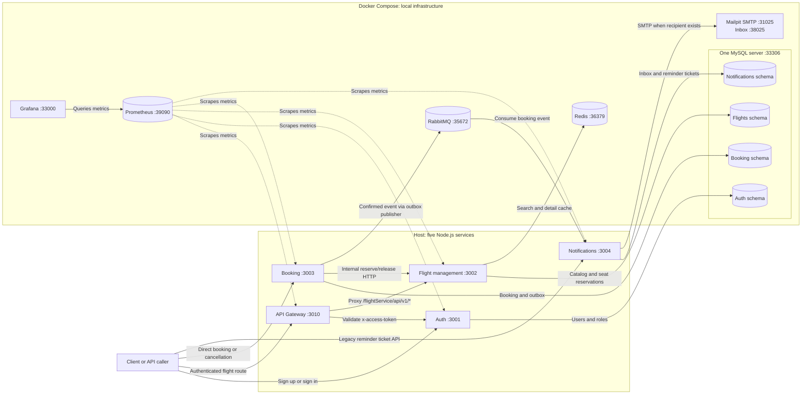
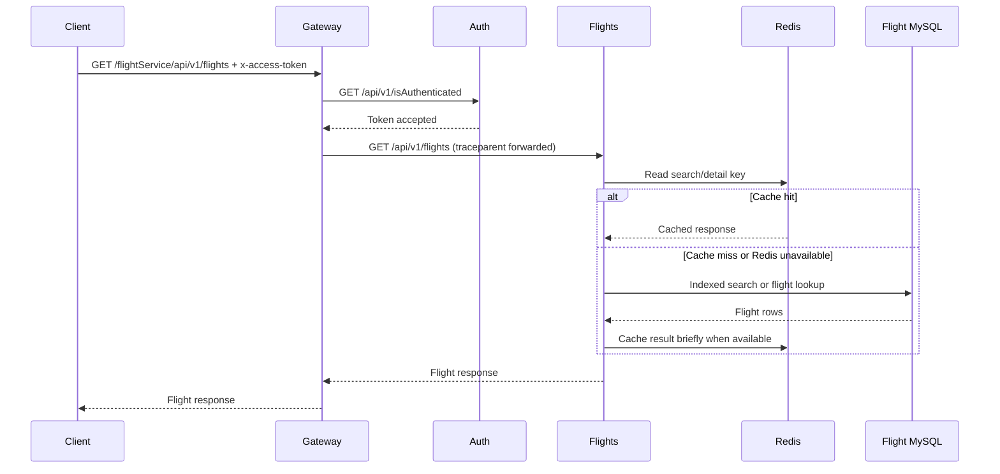
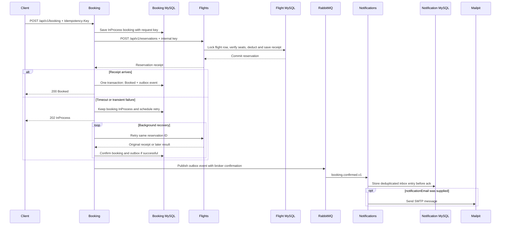

# Flight Booking architecture and request flows

This document describes the **implemented local system**. Five Node.js services run on the host. Docker Compose runs MySQL, Redis, RabbitMQ, Mailpit, Prometheus, and Grafana. There is no payment service, MongoDB, read replica, or deployed AWS topology in this checkout. The 200 requests/second target has not passed; see the [measured diagnosis](200rps-diagnosis.md).

## Whole-system diagram

Solid arrows are request, data, or event paths. Dotted arrows are Prometheus pulling metrics from services. The four database schemas share one MySQL container; the diagram does not imply four database servers. Service HTTP ports use `http://[::1]:PORT` in the local setup, while Docker UI ports bind to `127.0.0.1`. The gateway currently proxies **flight routes only**. Booking and legacy reminder APIs are called directly and must not be treated as protected by the gateway's token check. The [API reference](project-guide.md#api-reference) lists the exact routes.

| Component | What it owns |
| --- | --- |
| Gateway | Five-request/IP/two-minute rate limit, synchronous token check through Auth, and `/flightService` route proxy |
| Auth | Users, roles, sign-in, and token verification |
| Flight management | Cities, airports, flights, indexed route search, Redis cache, and transactional seat reservation/release |
| Booking | Idempotent requests, pending recovery, cancellation, confirmed booking records, and transactional outbox |
| Notifications | RabbitMQ consumer, deduplicated inbox, SMTP delivery worker, and the separate legacy reminder-ticket API |
| MySQL | Transactional source of truth for users, flights/seats, bookings/outbox, and notification state |
| Redis | Short-lived search/detail response cache; **never** decides whether a seat can be booked |
| RabbitMQ | Asynchronous confirmed-booking event delivery, retry queue, and dead-letter queue |
| Prometheus and Grafana | Scraped metrics and dashboard; they do not store logs or render distributed trace waterfalls |

## Flight search or details

Search and detail responses have a maximum **five-second TTL**. Flight edits and committed reservations invalidate affected cache generations. If Redis is unavailable, the flight service falls back to MySQL with a bounded number of active source loads; at high load, excess reads can return 503. This is the measured failing path in the [200 requests/second investigation](200rps-diagnosis.md). A displayed cached seat count can be briefly stale, but booking checks MySQL under a row lock rather than trusting it. See the [cache design](redis-caching.md).

## Booking, recovery, and notification

The flight row lock, seat deduction, and reservation receipt are one MySQL transaction. Booking confirmation and its outbox event are another transaction in the booking schema; no transaction spans both services. A stable booking ID and `Idempotency-Key` let recovery retry without deducting seats twice. Insufficient seats produce a terminal booking rejection; a 202 response means **pending**, not confirmed. The outbox publisher can retry when RabbitMQ is down, and the notification consumer records each event before acknowledging it. Mailpit captures local SMTP messages, not external delivery. See [reservation correctness](transactional-reservations.md) and [RabbitMQ delivery](rabbitmq.md).

Cancellation uses `POST /api/v1/booking/{id}/cancel` with the original key and `userId`. Booking saves cancellation intent, then asks Flights to release the reservation. The flight service restores seats and marks the receipt released transactionally. If release is delayed, the API returns 202 and recovery retries it. A confirmed-booking notification may already have been sent; cancellation notifications are not implemented.

## Observability and operational boundary

All five Node services write structured JSON logs with a `traceId`. The gateway forwards `traceparent` to Auth and Flights; Booking forwards it to Flights, and the outbox/RabbitMQ event carries it to Notifications. This lets operators correlate log records across those paths, but there is **no central trace storage/UI**. Prometheus scrapes protected `/internal/metrics` listeners and Grafana queries Prometheus for request, dependency, booking, and background-work panels. RabbitMQ queue depth is available through `node scripts/rabbitmq-status.js`, not a dashboard panel. Open the local [Grafana dashboard](http://127.0.0.1:33000/d/flight-booking-overview), [Prometheus targets](http://127.0.0.1:39090/targets), [RabbitMQ management UI](http://127.0.0.1:35673), or [Mailpit inbox](http://127.0.0.1:38025) after startup. See the [run instructions](project-guide.md#first-time-local-setup) and [monitoring details](monitoring-dashboard.md).

The current stack has one process per service, one MySQL server, one Redis instance, and one RabbitMQ instance. Horizontal replicas and a flight read replica shown in the [scaling-plan PNG](architecture-diagram-after.png) are **proposals**, not deployed components. MySQL remains the system of record; no MongoDB migration is justified by the measured access patterns. The [scaling plan](scaling-plan.md) separates implemented work from conditional next steps.
