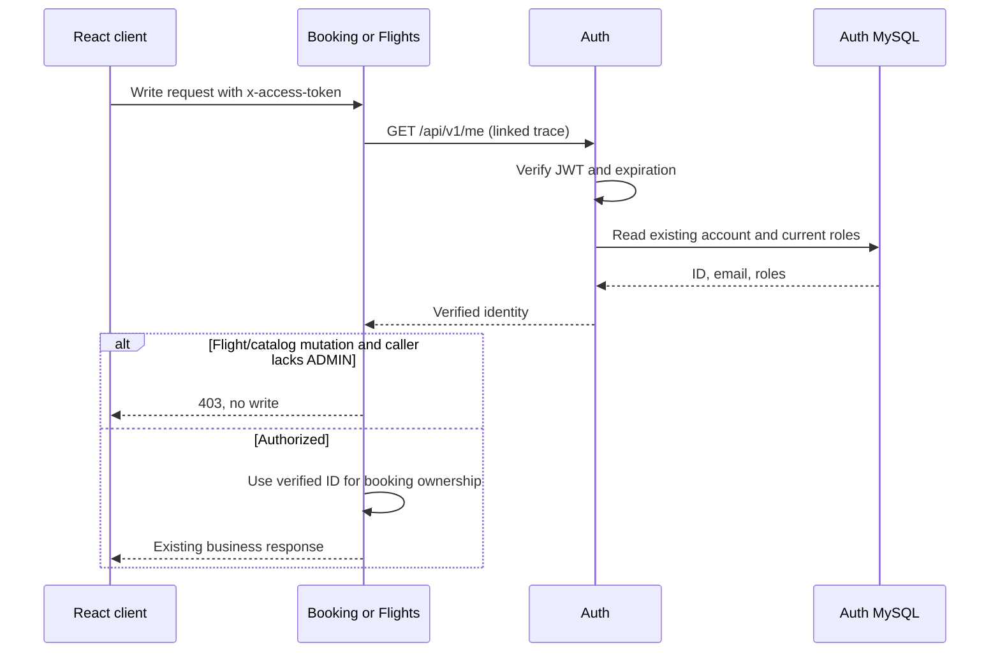

# Backend authorization

Flight/catalog mutations previously accepted unauthenticated requests, and booking trusted a browser-provided `userId`. The services now enforce authorization at their own HTTP routes, including when called directly through the Vite development proxy.



## Route rules

| Operation | Required identity |
| --- | --- |
| Direct flight search, detail, cities, catalog | Public reads |
| City create/bulk create/update/delete; airport, aircraft, flight create; flight update | Valid token and current ADMIN role |
| Booking create/retry | Valid token; body `userId` is ignored |
| Booking cancellation | Valid owner token and original idempotency key; body `userId` is ignored |
| Auth `/me`, `/isAuthenticated`, `/isAdmin` | Valid `x-access-token`; role checks use its owner |
| Auth user lookup/deletion | Same account or ADMIN |
| Internal reservation/release and metrics | Existing independent service keys |

Flight and booking guards accept `x-access-token` or `Authorization: Bearer …`. They forward the token to Auth's `/me` endpoint. Set `AUTH_SERVICE_URL` on Flight and Booking when Auth is not at the default `http://[::1]:3001`. Auth verifies the JWT and reads current roles from MySQL on every check, so deleting an account or removing an admin role takes effect on its next request. JWTs expire after one hour. Missing, invalid, or expired credentials return 401; an insufficient role returns 403. Auth failures and its two-second dependency timeout return 503 without running the protected handler. A different booking owner or wrong cancellation key returns 404.

## Local admin setup

After initial database setup, run from the repository root:

```powershell
node scripts/create-local-admin.js
```

The script only accepts the dedicated localhost `baseline_auth` database on port 33306. It creates a randomly named admin account and a random password, stores them in ignored `.local/admin-credentials.json`, and refuses to replace existing credentials. Open that local file and use its email/password in the React sign-in dialog. Ordinary sign-up never grants ADMIN. Credentials must not be committed or copied into documentation.

Start Auth, Flights, and Booking, then run:

```powershell
node scripts/seed-demo-catalog.js
node --test scripts/auth-guards.test.js
node scripts/verify-security.js
```

The seed script signs in using the local admin credentials. The smoke, reservation, Redis, RabbitMQ, observability, and k6 helpers now send tokens for protected writes. k6 preparation refreshes its fixture token before each run; fixtures and tokens remain in ignored `.local/`.

## Scope and capacity

The React console checks roles for navigation, while the backend remains the enforcement boundary. My journeys still contains only receipts retained in the current browser session; durable booking history is a separate next step. Legacy notification-ticket routes and the development proxy remain local-only. This is an authorization retrofit, not a claim that the entire system is ready for public deployment.

Booking now performs an additional auth lookup, including retries and cancellation. Public flight reads do not acquire that dependency. Existing 20/200 requests-per-second measurements predate these guards and must not be presented as measurements of this version. Rerun those benchmarks when returning to the deferred capacity work.

## Verification on 2026-10-05

The live security checks passed for missing/invalid tokens, customer rejection on every catalog write route, admin city creation/deletion, forged booking IDs, idempotent retries, and cancellation ownership. The isolated guard tests also passed for unavailable auth and malformed identity responses. Existing regression checks passed: 13 reservation checks, 13 Redis checks, all 14 smoke checks, 10 observability checks including the linked auth span, and 10 RabbitMQ/SMTP checks. The React production build passed. These are functional checks, not a new load-test result. The [regression evidence](authorization-verification.json) records their timestamps and individual checks.
