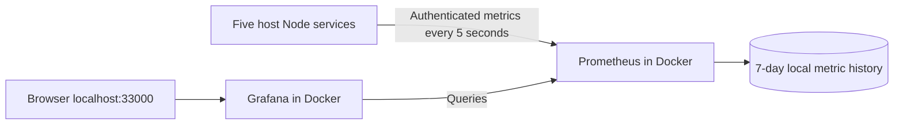

# Prometheus and Grafana in Docker

The dashboard is running at [Flight Booking · Service Overview](http://127.0.0.1:33000/d/flight-booking-overview). It opens in read-only viewer mode without signing in. [Prometheus targets](http://127.0.0.1:39090/targets) show the five scrape endpoints and their health.



Prometheus collects and stores metrics. Grafana queries that history to draw the panels. Application logs remain JSON files in `.local/`; this dashboard does not collect logs or export traces.

## What you can see

- Scrape health for auth, booking, flights, notifications and gateway.
- Requests per second summed across service hops.
- Booking response confirmation percentage, including idempotent retries.
- HTTP 5xx percentage, estimated p95 HTTP latency and dependency p95 latency.
- Booking outcomes, process memory and background-job completions.

Rate panels use a two-minute window. Idle ratios show **No traffic / data**, rather than implying successful bookings. p95 values are estimates from the existing histogram buckets. Scrape health means the metrics endpoint is reachable and readable; it does not prove that booking or payment flows work. Historical k6 results are not imported into these charts. The 200 requests/second investigation remains parked.

## Ports and authentication

| Component | Host port |
| --- | ---: |
| Grafana UI | 33000 |
| Prometheus UI/API | 39090 |
| Auth metrics | 13001 |
| Flight metrics | 13002 |
| Booking metrics | 13003 |
| Notification metrics | 13004 |
| Gateway metrics | 13010 |

Docker-to-host requests to application ports 3001–3003 reached unrelated existing IPv4 listeners and returned 404. Therefore each application has an optional `METRICS_PORT` listener dedicated to `/internal/metrics`. These listeners bind IPv4 so Docker Desktop can reach them via `host.docker.internal`. They require the existing `x-observability-key`; business API routes return 404 there. The original application ports and original authenticated metrics routes are unchanged.

The two Docker UI ports bind only to `127.0.0.1`. Grafana anonymous access is Viewer, not Editor/Admin; signup is disabled. An initial random admin password is saved in ignored `.local/monitoring/grafana-admin-password`, and existing values are preserved. Metrics keys are copied from each service's ignored `.env` into `.local/monitoring/secrets/` and mounted read-only. No keys appear in the committed config, dashboard JSON or verification report. These are local-development access settings, not a public hosting configuration.

## Reproduce the setup

The existing local stack is already configured and running. For another checkout, first complete local service setup and install their locked dependencies. Then:

```powershell
node scripts/configure-observability.cjs
node scripts/sync-observability.cjs
node scripts/configure-monitoring.cjs
node scripts/build-dashboard.cjs
# Start/restart the host service processes to load METRICS_PORT.
# start-local.ps1 starts stopped services; it refuses to replace running processes.
docker compose -f compose.local.yml --profile observability up -d --wait prometheus grafana
```

Use `.local/processes.json` to identify existing service processes before stopping/restarting them; do not rerun the initial database bootstrap. The monitoring config generator validates all keys and distinct port values before writing, and preserves already configured metrics ports and the Grafana password. After rotating a service's metrics key, regenerate monitoring config, restart that host service and restart Prometheus to reload its config.

The `observability` Compose profile keeps the dashboard optional. Ordinary first-time database/Redis startup does not require generated monitoring files. Once running, the dashboard has persistent Docker volumes for Grafana state and Prometheus samples. Prometheus retention is bounded by 7 days and a 512 MB TSDB retention setting; total on-disk usage can include additional WAL/head data.

```powershell
# Stop only monitoring; keep applications, Redis and MySQL running.
docker compose -f compose.local.yml --profile observability stop prometheus grafana
# Resume with preserved history.
docker compose -f compose.local.yml --profile observability up -d --wait prometheus grafana
```

Provisioned files under `observability/grafana/` create the data source and dashboard automatically. Edit `scripts/build-dashboard.cjs` and regenerate the JSON to change panels; UI edits are disabled. Grafana polls provisioning files every ten seconds; reload the browser to see dashboard-definition edits.

## Validation and limits

All six checks in [monitoring-test-results.json](monitoring-test-results.json) passed:

1. All five Prometheus targets are UP.
2. Prometheus stores live process metrics from every service.
3. A read-only flight request increments the collected HTTP counter.
4. Dedicated metrics ports reject missing credentials and do not expose business routes.
5. Grafana provisions the expected panels, and every PromQL expression executes successfully.
6. Grafana's data source returns all five UP targets through its query API.

Repeat with `node scripts/verify-monitoring.cjs`; the live-read check uses the existing synthetic Redis-test flight fixture. `promtool check config` also passed, and the dashboard was visually checked in the browser. All nine existing observability checks passed after introducing the dedicated listeners. No k6 stress test, payment or email delivery was performed for this monitoring step.

This adds collection and a dashboard. Alerts, a log aggregator, distributed trace storage and database replication remain future work. [RabbitMQ was added subsequently](rabbitmq.md); its application counters are scraped, while queue depth is currently available through the status script rather than a dashboard panel. Data begins when Prometheus first scrapes; process counters reset on service restart, and `rate()` handles counter resets. First-ever counter samples do not reveal when the preceding events occurred.

Configuration references: [Prometheus scrape configuration and file-backed headers](https://prometheus.io/docs/prometheus/latest/configuration/configuration/), [Grafana data-source and dashboard provisioning](https://grafana.com/docs/grafana/latest/administration/provisioning/). Images are pinned to `prom/prometheus:v3.13.3` and `grafana/grafana:13.2.3`.
