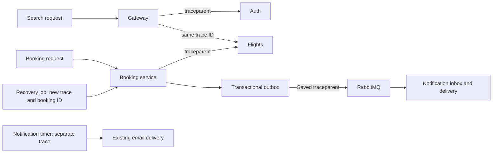

# Observability foundation

This observability retrofit added structured logs, basic distributed trace correlation and metrics to the five services present in the checkout while the 200 requests/second investigation was parked. The investigation has since resumed; see the [trace and metric diagnosis](200rps-diagnosis.md). Instrumentation itself makes no 10x-capacity claim.

## What is instrumented

| Service | Local port | Coverage |
| --- | ---: | --- |
| Gateway | 3010 | Incoming requests, authentication call, flight proxy forwarding/errors |
| Auth | 3001 | Incoming requests and safe controller error events |
| Flights | 3002 | Incoming requests, reservations, safe controller errors |
| Booking | 3003 | Incoming requests, reservation/release calls, booking response outcomes, recovery jobs |
| Notifications/reminder | 3004 | Incoming requests, scheduled polling, delivery success/failure events |



Auth, booking and flights do not form one connected gateway booking workflow today: the gateway only proxies flight routes. Payments are absent. The subsequent [RabbitMQ integration](rabbitmq.md) connects booking confirmation to notifications with durable trace propagation. This still does not constitute an all-five-service booking trace.

## Structured logging

Service stdout is JSON Lines. Each event has `timestamp`, `level`, `service` and `event`. Request events also include `traceId`, `spanId`, optional `parentSpanId`, HTTP method, route template, status and duration. Booking events include the booking ID for correlation.

```json
{"timestamp":"2026-09-30T16:00:00.000Z","level":"info","service":"booking","event":"booking.response","traceId":"0123456789abcdef0123456789abcdef","spanId":"0123456789abcdef","bookingId":123,"outcome":"Booked"}
```

The example is illustrative. Real logs are in `.local/<service-directory>.stdout.log` when launched by the local startup script. Find a request using the `x-trace-id` response header, then search that ID across the service logs:

```powershell
rg 'YOUR_TRACE_ID' .local -g '*.stdout.log'
```

Legacy console dumps of credentials, tokens, users, request bodies, database query text and email configuration were removed. The logger accepts an allowlist of event fields. It does not serialize arbitrary errors, Axios objects, headers or request bodies. SQL logging is disabled in each Sequelize model initializer. Controller failures log the error type rather than raw messages that may contain input. Existing log files from earlier versions are not retroactively sanitized.

## Trace behavior

Each request accepts a valid W3C version-00 `traceparent` header or creates a random 128-bit trace ID. Invalid/all-zero IDs are replaced. Each service creates its own span ID. AsyncLocalStorage keeps simultaneous requests separate. Responses return `x-trace-id` and `traceparent`; gateway authentication and booking-to-flight calls propagate child-span context. A response or aborted connection is logged once.

These are log-based spans and propagation, not an OpenTelemetry collector/Jaeger deployment. No sampling/export backend has been installed. All request-completion events are currently logged, even when an incoming sampling flag is zero. IDs are diagnostic correlation values, never authorization credentials.

Background recovery creates a **new** trace per attempt and records `bookingId`, linking it to the earlier booking log. New bookings now also persist their original trace context for outbox publication and RabbitMQ notification processing across restarts. Legacy notification timer runs still start independent traces.

## Metrics

Every service exposes `GET /internal/metrics` in Prometheus text format. It requires `x-observability-key` matching that service's `OBSERVABILITY_KEY`. Missing server configuration returns 503; invalid/missing credentials return 401. The endpoint has its own authentication and sits before the gateway's user-token check and rate limiter, allowing scraping without changing either policy for application requests.

| Metric | Meaning |
| --- | --- |
| `http_requests_total` | Request count by service, method, route template and status |
| `http_request_duration_seconds` | HTTP latency histogram, including failures |
| `dependency_duration_seconds` | Histograms for gateway authentication and booking reservation/release calls, split by outcome |
| `booking_responses_total` | Create/retry response outcomes: Booked, InProcess, Cancelled or error |
| `background_jobs_total` | Completion outcomes of recovery attempts and notification polls |
| `notification_deliveries_total` | Delivery/update success or error outcomes |
| `booking_events_total` | Outbox publication success/error attempts |
| `booking_notifications_total` | RabbitMQ notification processing outcomes |
| `booking_notification_deliveries_total` | Inbox delivery outcomes: Sent, DryRun or error |
| `process_uptime_seconds`, `process_resident_memory_bytes` | Process lifetime and resident memory |

Metrics use bounded method/route/outcome labels. They do not label by user ID, booking ID, trace ID, raw URL or query string. Unknown paths share `unmatched`. Metrics requests themselves are excluded from application request counts. Counters reset when a process restarts and must be scraped from each instance separately when scaling out.

The booking counter measures **responses**, including idempotent retries, not unique completed bookings. Pending responses are not confirmed successes. For a response confirmation rate, divide the rate of `outcome="Booked"` by the rate of all booking outcomes. Durable inventory reconciliation remains the authority for booking correctness. Dependency success describes the HTTP client call; semantic receipt validation can still fail afterward. Notification poll completion is distinct from individual delivery success.

Payment latency is not emitted because there is no payment service. RabbitMQ queue depth is available through `node scripts/rabbitmq-status.js`, but is not yet scraped by Prometheus. The existing flight cache metrics endpoint remains available separately; Redis timings, event-loop profiling and the load-test investigation are deferred as requested.

## Run and inspect

Fresh setup now writes an observability key. For an existing local checkout:

```powershell
node scripts/configure-observability.js
# Restart the local service processes after configuring their environment.
node scripts/read-metrics.js booking
node scripts/read-metrics.js flights
```

The read helper loads the key internally without printing it. The subsequent [Docker monitoring setup](monitoring-dashboard.md) now collects these metrics in Prometheus and displays them in Grafana. The optional dedicated `METRICS_PORT` listener exposes only the authenticated metrics route for Docker-to-host scraping; application routes are unchanged.

The runtime uses Node's built-in APIs and adds no package dependencies. Its canonical source is `observability/runtime.js`. Each service has an identical `src/observability.js` copy so it can still run as a standalone repository. After editing the canonical source, run `node scripts/sync-observability.js`; verification checks for drift.

## Verification

Run `node scripts/verify-observability.js` with local services, Redis/MySQL and the existing synthetic test fixtures available. It verifies protected metrics on all services, concurrent context isolation, malformed trace handling, cross-service parent links, JSON logs, credential exclusion and metric labels. It reserves one synthetic seat and releases it afterward; no payment or email is sent. It uses one gateway request; allow the existing two-minute gateway rate-limit window to reset after the five-request smoke test.

Results are saved in [observability-test-results.json](observability-test-results.json), including trace IDs that can be looked up in current local logs. Existing smoke and reservation checks validate that instrumentation preserves the current application behavior. The full 200 requests/second tests were intentionally not rerun in this step.

Validated on September 30: all 9 observability checks, all 14 smoke checks and all 13 transaction/recovery checks passed. This includes reservation crash recovery with the new outbound tracing wrapper. Logs and in-memory counters are available in the currently running local services.
