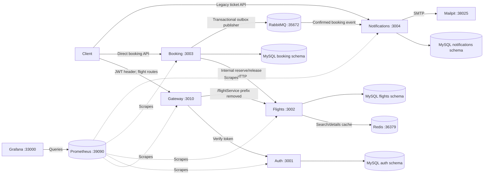
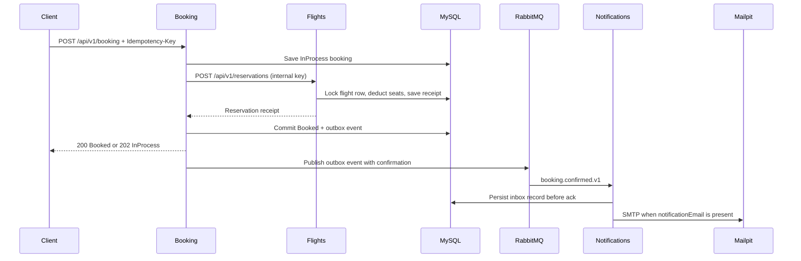

# Flight Booking project guide

This guide describes the **current implementation** in this workspace: five Node.js processes (gateway, auth, flights, booking, notifications) and local Docker infrastructure. MySQL is the transactional system of record. Redis caches flight reads; RabbitMQ carries confirmed-booking events; Prometheus and Grafana show service metrics. There is **no payments service** by project decision. The gateway exposes flight routes only; booking currently uses its direct service API. The local stack is a demonstration, not a deployed AWS environment or a proven 200 requests/second system.

The combined repository keeps the five service folders, `frontend/`, `compose.local.yml`, `scripts/`, `load-tests/`, `observability/`, `messaging/`, and `docs/` together so the local setup works from one checkout. It is a source snapshot of the original independent [gateway](https://github.com/inductionotg/AIRLINE-MANAGEMENT_API_GATEWAY), [auth](https://github.com/inductionotg/Auth_Service), [flights](https://github.com/inductionotg/FlightandSearchService), [booking](https://github.com/inductionotg/Booking_Service), and [notifications](https://github.com/inductionotg/ReminderService) repositories plus this assignment's changes. The original repository histories remain in those projects; the combined repository begins with one snapshot commit.

## Architecture

For the annotated Mermaid diagrams and step-by-step request flows, see [Flight Booking architecture and request flows](architecture.md).


The second PNG distinguishes implemented parts from proposed replicas. This Mermaid diagram shows **only what currently runs locally**:



The four MySQL schemas are in **one** local MySQL container. Redis, RabbitMQ, Prometheus, Grafana and Mailpit are Docker services; the five Node services run on the host. Docker ports bind to loopback. The Node HTTP services are reached in this setup through IPv6 loopback (`http://[::1]:PORT`).

| Service | Responsibility | Local API |
| --- | --- | --- |
| Gateway | Five-request/IP/two-minute limiter, calls auth, proxies `/flightService/*` to flights | `http://[::1]:3010` |
| Auth | Users, sign-in and token verification | `http://[::1]:3001` |
| Flights | Catalog/search, availability, transactional reservations and Redis invalidation | `http://[::1]:3002` |
| Booking | Idempotent booking/cancellation, recovery and RabbitMQ outbox | `http://[::1]:3003` |
| Notifications (`ReminderService`) | Legacy reminder tickets and booking-event email delivery | `http://[::1]:3004` |

### What happens during a booking



The seat decision is made in a MySQL transaction, **never from Redis**. The flight cache stores search and detail responses for at most five seconds and invalidates them after committed flight or reservation changes. If a booking's flight call times out, the booking stays `InProcess` and recovery retries the same reservation ID; a 202 response is not a confirmed booking. RabbitMQ delivery is asynchronous and a booking can confirm while the broker is temporarily unavailable. The original trace ID is propagated through HTTP and the event; there is no centralized trace viewer yet. See [reservations](transactional-reservations.md), [Redis](redis-caching.md), [messaging](rabbitmq.md), and [observability](observability.md).

## First-time local setup

Prerequisites: **Windows PowerShell, Node.js 22 with npm, and Docker Desktop with Compose**. Clone/copy the complete workspace layout shown in the root [README](../README.md); a single original service repository does not contain the shared scripts or Compose file. Run from the workspace root:

```powershell
$services = @('Auth_Service', 'FlightandSearchService', 'Booking_Service', 'ReminderService', 'AIRLINE-MANAGEMENT_API_GATEWAY')
foreach ($service in $services) {
    Push-Location $service
    npm ci
    if ($LASTEXITCODE -ne 0) { Pop-Location; throw "npm ci failed: $service" }
    Pop-Location
}
docker compose -f compose.local.yml up -d --wait
node scripts/setup-local.js
node scripts/configure-rabbitmq.js
node scripts/configure-local-smtp.js
node scripts/configure-observability.js
node scripts/configure-monitoring.js
node scripts/build-dashboard.js
docker compose -f compose.local.yml --profile messaging --profile observability up -d --wait
./scripts/start-local.ps1
node scripts/smoke-local.js
node scripts/verify-monitoring.js
```

`setup-local.js` creates four **new** baseline schemas, runs migrations, and writes generated local `.env`/database config. It refuses existing configuration or schemas: **run it once per fresh environment**. Configuration generators keep local secrets in ignored files. The startup script starts the five host Node processes and records PIDs/logs in ignored `.local/`; it refuses occupied IPv6 service ports. On later starts, run Docker Compose and `./scripts/start-local.ps1` only after confirming these processes are stopped; do not rerun the database bootstrap. Check `.local/*.stderr.log` and [local setup notes](../README.md) when startup or smoke verification fails.

The `scripts/*.js` files and the Node helpers in `load-tests/` still use CommonJS (`require`) because this repository does not set `"type": "module"`; the extension change does not change what they do. The separate k6 workload files use k6's module syntax and run under k6, not Node. Setup/configuration scripts are needed for a fresh checkout, while `verify-*.js` and the k6 scripts are checks and measurements.

The basic smoke test creates test records and makes several gateway calls. The gateway's five-request/IP/two-minute limiter can reject a repeated smoke run; allow its window to expire before repeating. Use [the k6 guide](../load-tests/README.md) for the separate 20 and 200 requests/second workloads. The current measured 200 requests/second workload **still fails**; see [the diagnosis](200rps-diagnosis.md) and [scaling plan](scaling-plan.md).

## Where to open the tools

Open these **on the machine running Docker** after the optional Compose profiles are up:

| Tool | URL | Purpose |
| --- | --- | --- |
| Grafana dashboard | [Flight Booking · Service Overview](http://127.0.0.1:33000/d/flight-booking-overview) | Request rate, HTTP errors/latency, booking outcomes and process health |
| Prometheus targets | [Prometheus targets](http://127.0.0.1:39090/targets) | Check that all five service metric endpoints are UP |
| RabbitMQ management | [RabbitMQ UI](http://127.0.0.1:35673) | Exchanges, queues and consumers; credentials are in ignored `.local/rabbitmq.env` |
| Mailpit inbox | [Mailpit](http://127.0.0.1:38025) | View locally captured booking email; no external delivery |
| Aeris web UI | [Aeris](http://127.0.0.1:5173) | Customer booking and local admin tools; start separately with `cd frontend; npm ci; npm run dev` |

Grafana allows anonymous **Viewer** access on local loopback. Its history comes from Prometheus, not from saved k6 runs. It does **not** display structured logs or a trace waterfall. Application JSON logs are in `.local/*.stdout.log`; correlate records with `traceId`. `node scripts/read-metrics.js booking` reads protected application metrics, and `node scripts/rabbitmq-status.js` reports queue depth. See [dashboard setup](monitoring-dashboard.md) for ports and verification.

## API reference

All service routes below start with `/api/v1`. Replace `{id}` with an integer. The five host services use different ports; the gateway is **not** a proxy for booking or notification routes.

| Service | Method and route | Purpose / important input |
| --- | --- | --- |
| Auth `:3001` | `POST /api/v1/signup` | Create user: `email`, `password` |
| Auth | `POST /api/v1/signIn` | Get token: `email`, `password` |
| Auth | `GET /api/v1/isAuthenticated` | Verify `x-access-token` header; called by gateway |
| Auth | `GET /api/v1/user/{id}` | Get user |
| Auth | `GET /api/v1/isAdmin` | Admin check; implementation reads `id` from request body |
| Auth | `DELETE /api/v1/signup/{id}` | Delete user |
| Gateway `:3010` | `* /flightService/api/v1/...` | Authenticates `x-access-token`, strips `/flightService`, forwards to flight service; rate limited |
| Flights `:3002` | `GET /api/v1/flights` | Search; filters: `departureAirportId`, `arrivalAirportId`, `minPrice`, `maxPrice` |
| Flights | `GET /api/v1/catalog` | List cities, airports and aircraft for the UI |
| Flights | `GET /api/v1/flights/{id}` | Flight details / displayed availability |
| Flights | `POST /api/v1/flights` | Create flight: `flightNumber`, `airplaneId`, airport IDs, departure/arrival times, `price` |
| Flights | `POST /api/v1/flights/{id}` | Update flight fields (this existing API uses POST) |
| Flights | `GET /api/v1/city`, `GET /api/v1/city/{id}` | List/get cities |
| Flights | `POST /api/v1/city`, `POST /api/v1/cityAll` | Create one/many cities |
| Flights | `PATCH /api/v1/city/{id}`, `DELETE /api/v1/city/{id}` | Update/delete city |
| Flights | `POST /api/v1/airports` | Create airport |
| Flights | `POST /api/v1/airplanes` | Create aircraft: `modelNumber`, `capacity` |
| Booking `:3003` | `POST /api/v1/booking` | Create/retry: `flightId`, `userId`, `noOfSeats`; optional `notificationEmail`; send stable `Idempotency-Key` |
| Booking | `POST /api/v1/booking/{id}/cancel` | Cancel: `userId` body and original `Idempotency-Key` |
| Notifications `:3004` | `POST /api/v1/createticket` | Legacy reminder: `subject`, `content`, `recepientEmail`, `notificationTime` (spelling is in the existing API) |
| Notifications | `DELETE /api/v1/deleteticket/{id}` | Delete legacy reminder ticket |

The flight service also has `POST /api/v1/reservations`, `POST /api/v1/reservations/release`, and `GET /api/v1/internal/cache-metrics`; these require an internal `x-reservation-key` and are **not client APIs**. Each service exposes `/internal/metrics` protected by `x-observability-key`, plus a dedicated local metrics port for Prometheus. Direct booking currently trusts the submitted `userId`; keep these direct APIs on the trusted local network and do not treat the gateway's flight authentication as booking authentication.

Example using PowerShell after startup, with IDs from your own seeded flights and users:

```powershell
$base = 'http://[::1]:3002'
Invoke-RestMethod "$base/api/v1/flights?departureAirportId=1&arrivalAirportId=2"

$booking = @{ flightId = 123; userId = 456; noOfSeats = 2; notificationEmail = 'demo@example.test' } | ConvertTo-Json
Invoke-RestMethod 'http://[::1]:3003/api/v1/booking' -Method Post -ContentType 'application/json' -Headers @{ 'Idempotency-Key' = 'demo-booking-123-456' } -Body $booking
```

The IDs above are placeholders; the initial database has no guaranteed flight ID 123 or user ID 456. A successful booking returns 200 `Booked`; a timeout/recovery path may return 202 `InProcess`, which can be retried with **the same key and body**. A conflicting key or unavailable seats can return 409. The [booking API behavior](transactional-reservations.md#api-behavior) documents cancellation and retry details. An email is sent to Mailpit only when `notificationEmail` is supplied and the booking confirms.

## Current scaling status

The normal-load assumption is 20 external requests/second (70% search, 20% detail, 10% booking), with a 200 requests/second target. The indexed search query is faster and row-locked reservations have settled with zero drift, but 200 requests/second still fails reliability. Traces, metrics and a flight CPU profile localize heavy failures to the flight read path: event-loop delay exceeds the Redis client deadline, fallback loads reach their bound, and excess reads return 503. Synchronous file-directed JSON logging is a substantial measured hot path on this Windows setup. No fix for that hotspot has been benchmarked yet. See [before/after results](before-after-metrics.md), [profile evidence](200rps-diagnosis.md), and the [MySQL/data-layer decision](scaling-plan.md#database-and-replica-strategy).
