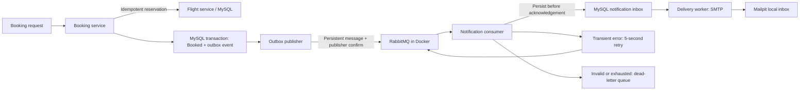

# RabbitMQ booking notifications

RabbitMQ now runs in Docker. Booking confirmation produces a durable event, and the notification service processes it asynchronously. Seat reservation stays in the existing transactional HTTP workflow. This isolates notification work from booking responses; it is not evidence that the parked 200 requests/second bottleneck is solved.



## Where reliability comes from

- Booking status and its `BookingOutboxes` row commit in one MySQL transaction. Failed insertion leaves the booking recoverable; the existing reservation receipt prevents another seat deduction.
- The publisher polls unpublished rows, locks one with `SKIP LOCKED`, and marks it published only after a broker confirmation. A three-second confirm deadline bounds each attempt. A broker outage leaves events in MySQL and does not fail an otherwise confirmed booking.
- A crash between publishing and recording confirmation can produce duplicate messages. The notification inbox uses a deterministic event ID and a unique booking ID; matching duplicates do not restart delivery. Conflicting payloads go to the dead-letter queue.
- The consumer acknowledges only after durable inbox persistence. Transient persistence failures use three delayed retries, then dead-lettering. Invalid messages go directly to dead-lettering. Retry/dead-letter copies must be confirmed before acknowledging the original.
- A separate delivery worker claims inbox rows with a lease and token. It retries failed delivery up to five attempts. Missing recipients become `NeedsRecipient` rather than receiving invented email addresses.

Publisher confirmation and consumer acknowledgement serve different purposes; see [RabbitMQ confirms and acknowledgements](https://www.rabbitmq.com/docs/confirms). The retry queue uses quorum at-least-once dead-lettering; see [dead-letter exchanges](https://www.rabbitmq.com/docs/dlx).

## Local setup

Dependencies are pinned in the booking and reminder lockfiles (`amqplib@2.2.0`). Run `npm ci` in both repositories after updating. With the existing local MySQL setup:

```powershell
node scripts/configure-rabbitmq.js
node scripts/configure-local-smtp.js
# Existing model-sync baseline only; fresh setups already include these migrations:
node scripts/apply-rabbitmq-migrations.js
docker compose -f compose.local.yml --profile messaging up -d --wait rabbitmq mailpit
# Restart booking and reminder processes to load their updated environment and code.
node scripts/rabbitmq-status.js
node scripts/verify-rabbitmq.js
```

Generate configuration before starting the messaging profile. The generator preserves existing values and stores random local credentials in ignored `.local/rabbitmq.env`, with connection URLs in each service's ignored `.env`. The additive migration helper is restricted to the known local baseline schemas; do not use it as a production migration-history repair tool. Fresh deployments use the service migration chains.

RabbitMQ is pinned to `rabbitmq:4.3.6-management`. AMQP uses localhost port **35672**; the [management UI](http://127.0.0.1:35673) uses **35673**, with credentials from the ignored local file. The named Docker volume retains broker data. Stop just RabbitMQ with `docker compose -f compose.local.yml --profile messaging stop rabbitmq`.

`configure-local-smtp.js` sets the notification worker to `smtp` with `SMTP_HOST=127.0.0.1`, port **31025**, and a local sender. It refuses to overwrite a different SMTP host or port. [Mailpit](http://127.0.0.1:38025) captures actual SMTP messages on localhost; it does not forward them to external mailboxes. This exercises Nodemailer's network handoff and the worker's `Sent` transition. Mailpit storage is ephemeral in this Compose setup.

Existing requests remain valid without `notificationEmail`; these become `NeedsRecipient`. To exercise delivery, add `"notificationEmail":"demo@example.test"` to the existing booking body. Reusing an idempotency key with a different recipient returns 409. Production should derive the recipient from the authenticated user's profile. For external delivery, configure a real SMTP host, port, sender, optional username/password and TLS according to that provider; external delivery has not been tested here.

## Traces and metrics

The booking stores its original `traceparent`; the publisher carries it in message headers and the consumer persists it for delivery. This allows the original trace ID to connect booking, flight reservation, publication, receipt and delivery even across worker restarts. Recovery attempts also retain their separate attempt traces linked by booking ID.

New Prometheus counters are `booking_events_total`, `booking_notifications_total`, and `booking_notification_deliveries_total`. Rabbit publication also records dependency latency. `node scripts/rabbitmq-status.js` reports ready messages, unacknowledged messages and consumer counts without printing credentials. Queue depth is not yet a Prometheus/Grafana panel.

## Verification and limits

All ten checks passed in [rabbitmq-test-results.json](rabbitmq-test-results.json): atomic outbox creation, traced SMTP consumption, a received message in Mailpit, concurrent idempotency, duplicate processing, malformed-message dead-lettering, delayed retry, retry exhaustion, outbox-insert recovery and missing-recipient compatibility. The duplicate test simulates repeat processing after persistence; it does not kill the consumer process. In `dry-run` mode, the inbox assertion is skipped and nine checks apply.

The actual broker-stop test passed in [rabbitmq-outage-results.json](rabbitmq-outage-results.json) while delivery mode was still dry-run: booking confirmed while RabbitMQ was stopped, its unpublished event remained in MySQL, and notifications processed it after restart. Cancellation restored the reserved seat. The test helper has `down` and `restored` modes; always restore the broker in a `finally` block when reproducing. Transaction checks (13), smoke checks (14), and migration checks (19) also passed before enabling SMTP.

A final rerun initially received 202 while the flight service was still starting. Logs showed recovery subsequently confirming and publishing that booking. Repeating with services ready passed all nine checks. This is distinct from the broker outage scenario. No new k6 measurements were made.

Each verification run intentionally leaves two malformed/exhausted messages in the canonical dead-letter queue for inspection. They are not production failures and are not automatically replayed or purged.

This is one local broker with durable quorum queues, not a highly available RabbitMQ cluster. Published outbox and inbox records currently remain in MySQL; retention and dead-letter operational procedures are deployment follow-ups. Existing already-confirmed bookings are not backfilled. Confirmation events represent a past confirmation; cancellation notifications are not implemented.

SMTP delivery was verified against the local Mailpit server. Acceptance by Mailpit shows delivery to this SMTP receiver, not arrival at an external mailbox. SMTP acceptance followed by a crash before the status update can send a duplicate on retry; a stable Message-ID does not guarantee exactly-once email. The existing reminder-ticket timer remains separate. There is no payment service in this checkout, and the gateway still only proxies flight routes, so this is not an all-five-service booking trace or a completed 10x-capacity claim.

## Main code

- `Booking_Service/src/services/booking-service.js`: transactional confirmation and outbox insertion.
- `Booking_Service/src/services/outbox-publisher.js`: recoverable confirmed publication.
- `ReminderService/src/services/booking-consumer.js`: validation, durable inbox, retries and acknowledgements.
- `ReminderService/src/services/booking-delivery.js`: leased delivery, SMTP and optional dry-run.
- `messaging/rabbitmq.js`: canonical topology and confirmed publishing; run `node scripts/sync-rabbitmq.js` after editing it.
