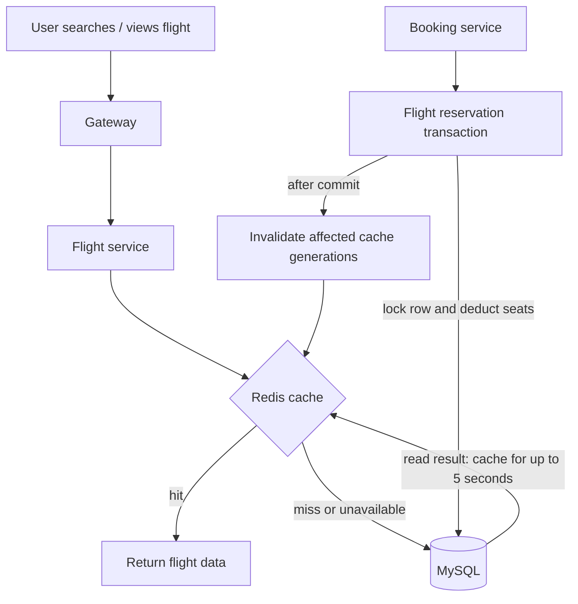

# Redis caching with Docker

Redis is implemented in the flight service for `GET /api/v1/flights` (search) and `GET /api/v1/flights/:id` (details). The audit measured repeated full-table search scans and overloaded read paths at 200 requests/second. This change reduces repeated SQL reads; it does not change MySQL's authority over bookings.



Caching happens **before booking**, when a user searches or views flights. After a booking or cancellation commits, affected entries are invalidated. Booking never trusts cached seats: the existing MySQL transaction checks and locks current inventory.

## Run locally

```powershell
docker compose -f compose.local.yml up -d --wait redis
docker compose -f compose.local.yml exec redis redis-cli ping
```

The expected response is `PONG`. Redis uses image `redis:8.10.2-alpine`, a 128 MB memory limit with `allkeys-lru` eviction, and no disk persistence because cached data can be rebuilt. The host binding is `127.0.0.1:36379`, mapped to container port 6379. The Node services still run on the host; configure the flight service with `REDIS_URL=redis://127.0.0.1:36379` and restart it. Fresh setup writes this value automatically. Other services do not need Redis credentials or clients.

This is a local development configuration. Redis has no password and must remain on trusted networks; it is not a production deployment configuration. If the flight service is later containerized on the Compose network, use `redis://redis:6379` there instead of host loopback.

## Freshness and invalidation

- Search keys include the supported origin, destination and price filters. Details are keyed by flight ID.
- Each entry lives at most 5 seconds, counted from the start of its database load. A slow query cannot create another full TTL of stale data.
- Flight creation, updates, seat reservation and seat release invalidate only after the database operation commits. Route edits invalidate both the old and new routes. All price variants of affected routes are invalidated together.
- Affected scopes are flight ID, origin, destination, origin/destination pair, and searches without route filters. Invalidation changes random generation tokens using Lua, without scanning keys. Old payloads expire naturally.
- Cache filling checks that the generation has not changed. A query started before a booking cannot repopulate the current cache after invalidation. Random tokens also prevent generation eviction from reviving old entries.
- A failed invalidation or a process crash between commit and invalidation can leave stale display data for the remaining TTL (at most 5 seconds). This is bounded eventual freshness, not a guarantee of immediate read-after-write consistency during failures. Transactional booking still uses current MySQL inventory.

The Lua operations target standalone Redis, as supplied here. Redis Cluster would require a different key-slot design.

## Failure and overload behavior

Redis operations have an 80 ms deadline, a one-second circuit cooldown after errors, disabled offline queuing and a bounded client command queue. Missing Redis falls back to MySQL. Identical concurrent reads share one database load within each Node process. At most 10 distinct database loads run concurrently per process; additional misses return HTTP 503 instead of building an unbounded backlog. This also applies when caching is disabled with `REDIS_ENABLED=false` (restart required).

These controls address the audit's timeouts and backlog. They cannot create unlimited MySQL capacity during an outage. Cache-hit handling and cross-process cache sharing are provided by Redis; request coalescing is per process, not a distributed lock.

## Evidence and inspection

`GET /api/v1/internal/cache-metrics` requires the existing internal `x-reservation-key`. It reports hits, misses, fallback loads, coalesced reads, rejected loads, errors, invalidations and connection readiness. Do not expose the service key to browser clients. The k6 runner records snapshots without saving the key.

- `node scripts/verify-redis.cjs`: real-Redis and HTTP integration checks, including expiration, invalidation, late fills and bounded fallback.
- `scripts/verify-redis-outage.cjs`: run while Redis is deliberately stopped, then always restore Redis with Compose. Verifies reads, booking and cancellation against MySQL. Do this separately from performance tests.
- Results: [cache checks](redis-test-results.json), [outage checks](redis-outage-results.json), [measured comparison](before-after-metrics.md).

No index, database engine, pool size, gateway policy or message broker change is bundled with this cache addition.
