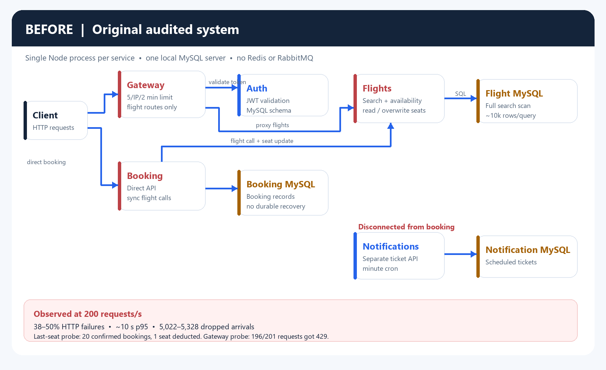
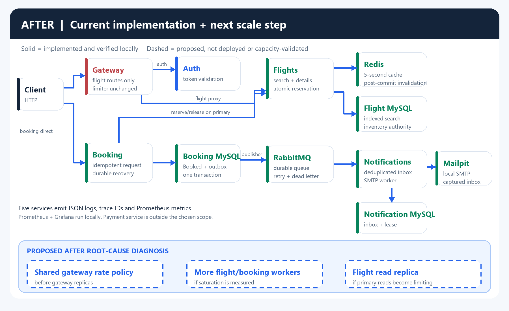

# Scaling plan: 20 to 200 requests per second

**Status: design and measured progress, not a 10x-capacity claim.** The approved local baseline is 20 external requests/second; the target is 200. The measured workload sends 70% flight searches, 20% flight details and 10% bookings directly to the flight and booking services. At the target, that is about **140 searches, 40 details and 20 bookings per second**. Gateway capacity is a separate test because the gateway does not expose booking and currently limits a single IP to five requests per two minutes. These are synthetic local workloads, not observed production traffic. See the [audit](bottleneck-audit.md), [k6 setup](../load-tests/README.md) and [before/after measurements](before-after-metrics.md).

The **before** diagram shows the audited original system. The **after** diagram separates implemented components (solid boxes and arrows) from capacity changes still proposed (dashed boxes and arrows). The local deployment still runs one Node process per service and one MySQL server, Redis and RabbitMQ container.

## Evidence and decisions

| Measured problem | Evidence | Change and expected effect | State |
| --- | --- | --- | --- |
| Gateway rejects ordinary single-client traffic | At 20 flight requests/s for 10 seconds, 5 of 201 gateway flight requests succeeded and 196 returned 429. | Define an authenticated-user/IP rate policy that permits the intended client mix, then test the public path. A shared limiter is required before adding gateway replicas. This cannot cure backend failures. | Policy unchanged; **blocking public 10x claim**. |
| Search misses scan the flight table | Original search examined about 10,043 rows for 100 results; mean search SQL time at 200/s was 12.66–13.25 ms. | A `(departureAirportId, arrivalAirportId, price)` index changed a representative plan to a 100-row range scan; mean SQL time after the index was about 1.02–1.05 ms. This saves database work per miss. | Implemented; end-to-end 200/s regressed. |
| Repeated reads load the flight path | At 200/s, the original system saw 38.30–50.19% HTTP failures, around 10-second p95 and 5,022–5,328 dropped arrivals. Flight CPU averaged about 0.86–0.89 core over the diagnostic intervals. | Redis caches search and detail responses for at most five seconds; invalidation follows committed flight changes and reservations. Coalescing and a ten-load cap bound misses per flight process. Expect less repeated SQL on hot routes, subject to cache health and miss rate. | Implemented; Redis-only 200/s runs still failed 30.34–44.42% of issued requests. |
| Concurrent booking corrupts inventory | A one-seat flight received 20 confirmed bookings while only one seat was deducted. Large original 200/s runs settled with 459–462 confirmed seats missing from deductions. | Row-locked reservations, unique booking IDs, idempotent retries and durable recovery prevent repeat deductions. The last-seat retest produced one confirmation, 19 insufficient-seat responses and zero drift. | Correctness fix implemented and verified; not a throughput proof. |
| Need to distinguish SQL time from application/Redis delays | With the index, search SQL improved, yet indexed 200/s runs had 70.62–71.25% HTTP failures, 433–529 cache hits, 547–549 Redis errors/deadlines and 8,459–8,522 rejected source reads. | Structured logs, trace IDs and cache counters exposed flight-read 503s. A [diagnostic repeat](200rps-diagnosis.md) found 786 Redis client deadline expiries, matching late completions, while sampled flight event-loop p99 delay averaged 388 ms against an 80 ms deadline. A CPU profile then found synchronous structured-log writes in 25.3% of active stack samples. Move logging off the synchronous request path before changing limits or instance count. | Failure path and a substantial local CPU hotspot identified; no performance fix or 10x claim yet. |
| Booking-to-notification work was disconnected | Original booking did not notify the reminder service. No load result showed it to be a 200/s bottleneck. | Transactional outbox, RabbitMQ, deduplicated inbox and SMTP worker make notification asynchronous and recoverable. This improves workflow completeness and outage behavior; no measured booking throughput gain is attributed to it. | Implemented; local SMTP delivery verified in Mailpit. |

The comparable indexed traffic runs are the [pre-index control](../load-tests/results/pre-index-10x/) and [two indexed runs](before-after-metrics.md#composite-search-index). Failure rate rose from 34.10% before the index to 71.25% and 70.62% after it, despite the faster SQL. Both indexed runs completed about 200 issued requests/s but failed reliability and business-response thresholds. Fast 503 responses can lower latency statistics; issued request rate is not successful capacity. The user subsequently resumed the investigation: [diagnostic runs and a CPU profile](200rps-diagnosis.md) identify flight cache fallback, event-loop delay and synchronous local log writes as the read failure path and a major contributor. Their different durations and profiling overhead make them diagnostic evidence, not a controlled before/after capacity comparison.

## Database and replica strategy

**Keep MySQL as the system of record for this plan.** Flight inventory, unique reservation IDs, booking state and outbox writes rely on relational constraints and transactions. The actual high-read search uses stable route and price columns, and its measured scan was corrected by one composite index. There is no measured schema-flexibility or query-shape problem that justifies a MongoDB migration. A document search projection could be evaluated only if later query requirements and measurements demonstrate a benefit; it would add consistency and rebuild work today.

The local environment has four schemas in **one** MySQL container, not four independently scalable databases. The flight schema now has the route/price index and reservation uniqueness; booking has request-key, recovery-due and unpublished-outbox indexes; notification delivery has a due-work index. Keep reservation and booking writes on the primary. Monitor query plans, slow queries, InnoDB lock waits, connection usage and replication lag before more schema changes.

**Do not add a read replica yet.** The original audit sampled at most 11 MySQL connections against a 151-connection limit, with zero max-connection errors. The later indexed runs failed despite a roughly 10x SQL speedup, so a replica is not supported as the next fix. If the flight primary later becomes read-bound after the application bottleneck is resolved, a replica can serve search/catalog reads. Reservations, availability decisions and all writes must still use the primary. Because replication can lag, a displayed seat count may be older than the five-second cache limit; monitor lag, set a freshness budget, and fall back to the primary when that budget is exceeded. Test stale-read and failover behavior before routing any availability display to a replica. Auth and booking replicas have no measured justification in this workload.

Connection limits must be budgeted across all processes before adding instances. Sequelize's default pool maximum is five per instance where no override is configured; multiplying processes multiplies possible database connections. Set explicit per-service pool budgets and leave headroom for maintenance and recovery, based on actual concurrent-query and wait-time measurements. Raising MySQL `max_connections` alone would not address the observed failures.

## Caching and consistency

Flight search and details use Redis before querying MySQL. Search keys include the supported filters. A five-second TTL limits stale displays; generation-token invalidation after flight edits, reservation and release keeps normal updates fresh without key scans. A late cache fill cannot overwrite a newer generation. If Redis fails, reads fall back to MySQL with an 80 ms command deadline, a short circuit cooldown and at most ten distinct database loads per flight process. Booking **never** makes a seat decision from cached availability. These rules and the outage test are in the [Redis design](redis-caching.md).

At 200/s, the ten-load fallback cap rejects many reads, while Redis errors and circuit bypasses increase. Do not simply raise the cap or TTL: that could shift the queue into MySQL or serve older availability. The CPU profile now identifies synchronous stdout logging in this local deployment as a substantial hot path. Change that first, then measure event-loop lag, Redis deadlines, cache hit/miss rates and DB pool wait time under the same workload. Multiple flight replicas share Redis entries, but their coalescing and ten-load caps are **per process**; aggregate miss pressure must be tested.

## Horizontal scaling and failure behavior

| Component | Scale-out decision | Prerequisite and verification |
| --- | --- | --- |
| Gateway | Add stateless instances behind a load balancer only after revising the five-request/IP policy. | Use a shared Redis-backed limiter keyed by authenticated identity with an IP fallback; check fairness and the full gateway path at 20 and 200/s. The current in-memory limiter would reset independently on each instance. |
| Auth | Scale independently if auth-call latency or CPU becomes a measured gateway bottleneck. | Each gateway flight request currently calls auth synchronously. Inspect dependency latency and auth saturation first; preserve token verification semantics. |
| Flights | Likely first candidate for more Node instances **after** diagnosing Redis and event-loop behavior. | All instances share MySQL and Redis; reservation correctness remains in MySQL. Verify aggregate DB connections, global miss pressure, cache invalidation across instances and p95/failure rate. |
| Booking | Add instances if booking CPU or pending recovery backlog becomes limiting. | Request-key uniqueness and flight reservation IDs preserve idempotency. Concurrent recovery attempts may duplicate work, though they must not duplicate seats; observe backlog and add a claim/lease if efficiency requires it. Outbox publishers already lock rows with `SKIP LOCKED`. |
| Notifications | Increase RabbitMQ consumers and delivery workers if queue depth or delivery delay grows. | Manual acknowledgements, unique inbox IDs and leased delivery support parallel workers. Respect SMTP provider rate limits; `Sent` means SMTP acceptance, not guaranteed mailbox arrival. |
| Redis/RabbitMQ/MySQL | Keep one instance of each for local demonstration. | Production availability may require managed/replicated services or a RabbitMQ quorum cluster. This is an uptime design choice, not an observed throughput fix. Test failover and capacity separately. |

Current Prometheus/Grafana covers five existing services: gateway, auth, flights, booking and notifications. RabbitMQ application counters are scraped; queue depth is available through `node scripts/rabbitmq-status.js` but has no dashboard panel. There is no payment service by user decision, and the gateway has no booking route; therefore a single booking does not traverse all five named assignment services. See [observability](observability.md), [dashboard](monitoring-dashboard.md) and [messaging](rabbitmq.md).

## Sequence to reach a credible 10x result

1. Use the completed [200/s diagnosis](200rps-diagnosis.md) as the change target: the 503 path is localized to flight cache fallback under heavy event-loop delay, and the CPU profile identifies synchronous local log writes as a substantial hot path. Keep gateway and backend capacity results separate.
2. Replace synchronous flight log output without losing structured records or trace IDs, then run a controlled comparison. Define and test a gateway rate policy suitable for authenticated clients. Test normal operation and Redis outage, including whether a bounded fallback meets the target.
3. Re-run k6 at **20 and 200 requests/s**, with fresh booking inventory, the same duration/mix and documented hardware. Require HTTP failures below 1%, valid business responses above 99%, read p95 below 500 ms, booking p95 below 1,000 ms, zero dropped arrivals and zero settled inventory drift. Report issued rate **and successful rate**. Verify no unprocessed outbox/inbox backlog after settling.
4. Scale a service only if its saturation is demonstrated. Repeat the same test after each replica count change, including DB connection budgets and cache-miss pressure. Run the gateway workload separately because its route and limiter differ from the direct-service workload.

## Changes deliberately deferred

- **No MongoDB/full data migration:** the measured search problem was an index miss on fixed fields; transactional inventory remains a strong fit for MySQL.
- **No blanket increase in DB connections, cache TTL or miss concurrency:** the measured failure is not connection exhaustion, and stale seats or shifted queues would hide rather than solve it.
- **No Redis seat counter or distributed booking lock:** the row-locked MySQL reservation already passes the oversell test and remains the authority.
- **No Kafka, event sourcing or full CQRS rewrite:** RabbitMQ and a transactional outbox address the current notification workflow; no measured need supports replacing the domain model.
- **No payments service:** explicitly excluded from the current scope by the user. Do not claim payment latency or a payment span.
- **No 10x success claim until the target workload passes.** Local SMTP acceptance and messaging correctness do not change the published capacity result.
