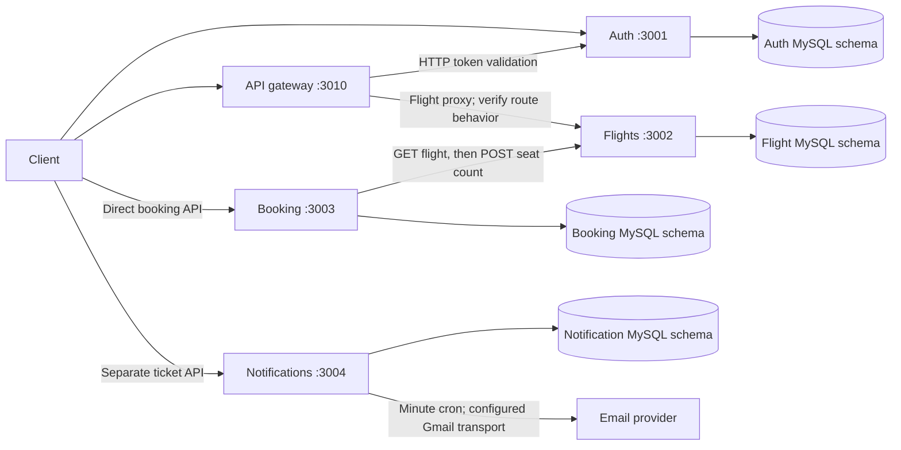

# Step 1: current system inventory

Inspected on 2026-09-29. This is a source inventory and local functional verification, not the performance bottleneck audit. No throughput, capacity, or latency conclusions have been measured yet.

Update: gateway routing and the fresh-database migration chain were subsequently repaired and verified. The inventory and initial findings below describe the original baseline; see the repair records at the end for current status.

## Repositories and baseline revisions

The workspace contains five independent Git repositories. They were clean at inspection. There is no parent Git repository. Preserve these revisions for before/after comparison; the folder layout has not been reorganized.

| Repository | Revision | Responsibility | Local port |
| --- | --- | --- | --- |
| AIRLINE-MANAGEMENT_API_GATEWAY | 4591b86 | Authentication forwarding, rate limiting, flight proxy | 3010 |
| Auth_Service | 28ca21a | Signup, sign-in, JWT verification, roles | 3001 (hardcoded) |
| FlightandSearchService | b5e78a7 | Cities, airports, airplanes, flights, search, seat updates | 3002 |
| Booking_Service | 4307dd7 | Booking records and synchronous flight calls | 3003 |
| ReminderService | e309fd9 | Notification tickets and periodic email delivery | 3004 |

The assignment's five business services do not match these five repositories: payments is absent and the fifth repository is a gateway. No RabbitMQ producer, consumer, dependency, Docker definition, or AWS deployment configuration was found in the original checkout. Redis is absent as expected before the retrofit. Notifications currently poll MySQL every minute using node-cron.

## Current architecture

There is no implemented booking-to-notifications link or payment step. Separate schemas in one local MySQL container represent the configured service data boundaries; the original production database topology is unknown.

## Endpoints and data

| Service | Main routes | Tables |
| --- | --- | --- |
| Auth | POST /api/v1/signup; POST /api/v1/signIn; GET /api/v1/isAuthenticated; GET /api/v1/isAdmin; GET /api/v1/user/:id | Users, Roles, User_Roles (model association) |
| Flights | GET/POST /api/v1/flights; GET/POST /api/v1/flights/:id; city CRUD; POST /api/v1/airports | Flights, Airplanes, Airports, Cities |
| Booking | POST /api/v1/booking | Bookings |
| Notifications | POST /api/v1/createticket; DELETE /api/v1/deleteticket/:id | NotificationTickets |

Search supports arrival/departure airport and min/max price filters. It calls `findAll` without pagination. Flight details use primary-key lookup. Booking reads the flight, creates an InProcess booking, writes an absolute remaining seat count, then marks the booking Booked. Those operations span separate requests and databases.

## Findings requiring follow-up

These are observed code/configuration facts and correctness risks, not measured performance bottlenecks.

1. Gateway rate limiter is configured for five requests per IP per two-minute window (`AIRLINE-MANAGEMENT_API_GATEWAY/src/index.js`). A single-source load test needs to report this policy separately from backend capacity.
2. Gateway forwards `/flightService` without a path rewrite, while flight routes begin `/api`. It exposes no booking proxy. Verify and record behavior before making routing changes.
3. Booking reads and overwrites seat counts without an atomic reservation or cross-service recovery (`Booking_Service/src/services/booking-service.js`). Concurrent overselling and partial failure need dedicated tests before any cache is added.
4. Booking's initial migration already creates `noOfSeats` and `totalCost`; the next migration adds both again. A fresh migration sequence needs repair. Auth models define `User_Roles`, but no migration creates it.
5. Database config files and all .env files were absent. Notifications also imports a missing, Git-ignored `src/config/serverConfig.js`. Auth imports PORT but listens on 3001.
6. No actual automated tests exist; each package's test script is a placeholder. Auth's start command references nodemon without declaring it; local startup uses `node src/index.js`.
7. Existing logs include password/token/secret values. Use generated test credentials only. Local logs are ignored; log redaction belongs in the observability work.
8. Existing airport seed data relies on city IDs 22/23. The smoke test creates its own related fixtures instead.

## Local verification boundaries

Node v22.14.0, npm 10.9.2, Docker Engine 29.2.0 were observed. Docker Desktop was initially stopped and was started. Locked dependencies were installed without upgrading package manifests or lockfiles.

`compose.local.yml` adds only local MySQL, bound to 127.0.0.1:33306. Application services run directly with Node on the host. `setup-local.cjs` creates four new baseline schemas and ignored local config, refusing existing schemas/configurations. It creates tables from the unchanged Sequelize models using `sync()` without `alter` or `force`; this is an explicit local bootstrap workaround, not proof that migrations work. Leave `DB_SYNC` and `SYNC_DB` unset (even the string `false` is truthy in the existing startup checks).

The smoke test checks signup/sign-in/token verification, flight creation/search, a two-seat booking with cost and seat assertions, independent notification ticket create/delete, and gateway routing. It creates a notification scheduled in 2099 then deletes it; no email is sent. It leaves isolated user/flight/booking fixtures for inspection. Reset or separate these fixtures when designing the load dataset.

Runtime outcomes are recorded in `step-1-smoke-results.json`. A successful direct booking does not establish payment, notification delivery, concurrency safety, gateway correctness, or 10x capacity.

## Observed smoke results

Run: 2026-09-29T11:16:11.052Z. Nine direct-service HTTP checks passed. Booking ID 1 for flight ID 2 returned Booked, total cost 5000, and remaining seats changed from 10 to 8. Independent notification ticket creation returned 201 and deletion returned 200. The authenticated gateway flight request returned 404; the smoke script deliberately exits 1 because that check failed.

The unchanged gateway preserves the `/flightService` prefix when forwarding, but the flight service has no matching route. This is a functional defect observed at one request, not a load-induced failure. Record its repair separately before benchmarking the gateway. The gateway's existing rate limiter also remains unchanged.

On this machine, another Node process occupied port 3000 and existing Docker listeners occupied IPv4 ports 3001–3003. They were left running. This local stack uses gateway port 3010 and IPv6 loopback for direct-service requests and booking-to-flight calls. The gateway's original localhost service targets remain unchanged. Early smoke attempts exposed these local port conflicts; the result file contains the final run, after local configuration was corrected.

Status: source inventory and direct booking verification complete; the full assignment's five-business-service flow is unavailable because payments and messaging are missing. Gateway route repair and migration repair remain prerequisite work. No tracked application source files were changed during this step.

## Gateway routing repair (2026-09-29)

Changed `AIRLINE-MANAGEMENT_API_GATEWAY/src/index.js` to remove the leading `/flightService` path segment before proxying. For example, `/flightService/api/v1/flights/3` now reaches the flight service as `/api/v1/flights/3`. Authentication and the existing rate limit remain in place.

Preserved the original failing results in `step-1-smoke-before-gateway-fix.json`. After restarting the gateway, `node scripts/smoke-local.cjs` exited 0 at 2026-09-29T11:21:32.550Z. All 14 HTTP checks passed: gateway flight details matched the direct service, search retained airport/price filters, an excluding price filter returned no flights, and missing/invalid tokens returned 401. The direct booking still changed seats from 10 to 8 and returned total cost 5000. Current results are in `step-1-smoke-results.json`.

This is a measured functional repair before the load-test baseline, not a scaling optimization. Migration defects and the missing payments/messaging scope remain unresolved.

## Migration repair (2026-09-29)

The initial booking migration no longer creates `noOfSeats` or `totalCost`; the following migration owns adding and removing those columns. This fixes the duplicate-column failure on a fresh schema and gives rollback a consistent sequence. Added `20260929120000-create-user-roles.js` to auth: a composite primary key on `UserId`/`RoleId`, timestamps, and foreign keys to Users/Roles with cascading deletes and updates. First-time local setup now executes the four services' migration histories instead of using model sync.

Ran `node scripts/verify-migrations.cjs` starting at 2026-09-29T11:24:14.023Z against four newly created local test databases. All 18 checks passed, including full up/down/up cycles for all four services, booking model compatibility and backfilled defaults for an existing row, auth model association methods, duplicate/invalid relationship rejection, and cascades from either parent. The four temporary databases were removed. Evidence: `migration-check-results.json`.

The running `baseline_*` databases were not migrated or modified by these checks. They were previously created with model sync and do not have a migration history; reconcile schemas and SequelizeMeta before using the migration CLI on them. Historical booking migration code was repaired for fresh installs, not replayed on any existing deployment. Existing installations that already applied the old initial migration require an explicit schema/history review before pending migrations or rollback; no automatic adoption is claimed.

Current prerequisite status: gateway routing and fresh-database migrations verified. Missing payments/RabbitMQ scope and the later load-test audit remain open.
